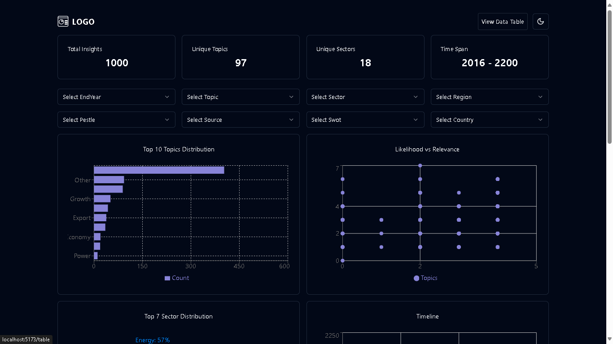
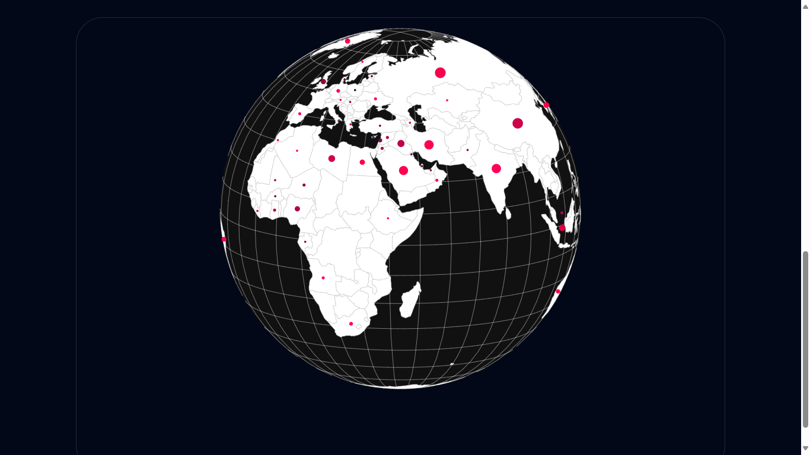
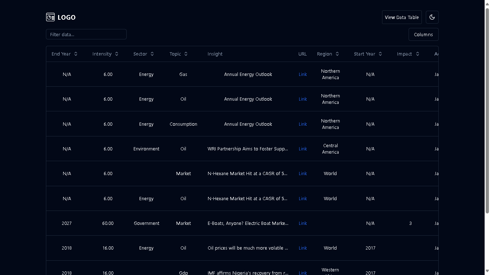

# Dashboard Visualization Project

This project is a powerful dashboard visualization tool built using Flask as the backend, MongoDB as the database, and React with TypeScript for the frontend. It leverages d3.js for data visualization and shadcn UI for a sleek, modern interface.

## Features

1. Transform JSON data into an interactive dashboard with dynamic charts and filters.
2. Dashboard analytics cards for quick insights.
3. Various chart types including:
   - Top 10 topic distribution bar chart
   - Relevance vs likelihood scatter chart
   - Top 7 sector distribution pie chart
   - Timeline scatter chart
4. Interactive 3D globe visualization for country-specific insights.
5. Data table with pagination, sorting, and searching capabilities.
6. Data cleaning for improved visualization accuracy.
7. SWOT (Strengths, Weaknesses, Opportunities, Threats) field for each insight.
8. Comprehensive filtering options:
   - End years
   - Topics
   - Sectors
   - Countries
   - Sources
   - PESTLE factors
   - Impact
   - Regions
   - SWOT categories

## Screenshots

Dashboard Overview


3D Globe Visualization


Data Table


## Prerequisites

- Docker
- Python 3.x
- Node.js and npm

## Setup

1. Clone the repository:
   ```
   git clone https://github.com/mohd-shibilicv/database_visualization_project.git
   cd database_visualization_project
   ```

2. Set up the backend:
   - Create a virtual environment:
     ```
     python -m venv venv
     source venv/bin/activate  # On Windows, use `venv\Scripts\activate`
     ```
   - Install dependencies:
     ```
     pip install -r requirements.txt
     ```
   - Copy the `.env.example` file to `.env` and configure as needed.

3. Set up MongoDB:
   - Pull and run the MongoDB Docker container:
     ```
     docker pull mongo
     docker run -d -p 27017:27017 --name mongodb mongo
     ```

4. Set up the frontend:
   - Navigate to the frontend directory:
     ```
     cd frontend
     ```
   - Install dependencies:
     ```
     npm install
     ```

## Running the Application

1. Start the Flask backend:
   ```
   python run.py
   ```
   The backend will be available at `http://127.0.0.1:5000`.

2. In a new terminal, start the React frontend:
   ```
   cd frontend
   npm run dev
   ```
   The frontend will be available at `http://localhost:5173`.


## Usage

- Open your web browser and go to http://localhost:5173.

- Explore the various charts, filters, and the interactive 3D globe.

- Use the data table for detailed views and analysis of the JSON data.


## Project Structure

The project follows a modular approach with clear separation between backend and frontend:

```
project_root/
│
├── backend/
│   ├── data/
│   ├── tests/
│   ├── app/
│   │   ├── models/
│   │   ├── routes/
│   │   ├── services/
│   │   └── utils/
│   ├── config.py
│   ├── run.py
│   └── requirements.txt
│
├── frontend/
│   ├── public/
│   ├── src/
│   │   ├── assets/
│   │   ├── components/
│   │   ├── lib/
│   │   ├── services/
│   │   ├── App.tsx
│   │   ├── index.css
│   │   └── main.tsx
│   ├── package.json
│   ├── tsconfig.json
│   └── vite.config.ts
│
├── .gitignore
├── README.md
└── env.example
```

## Acknowledgements

- Thanks to the open-source community for the libraries and tools used in this project.

